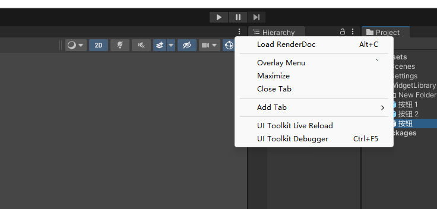
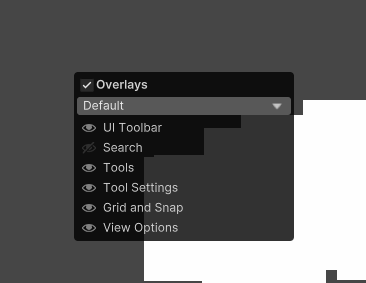
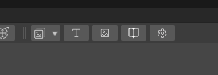
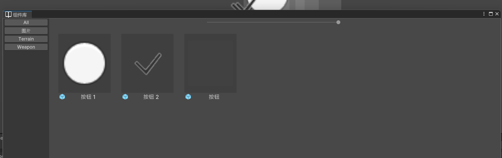
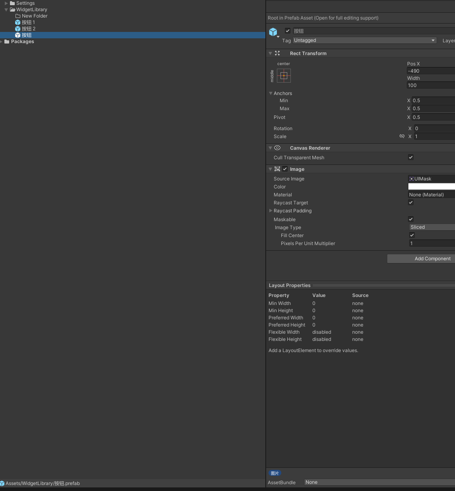
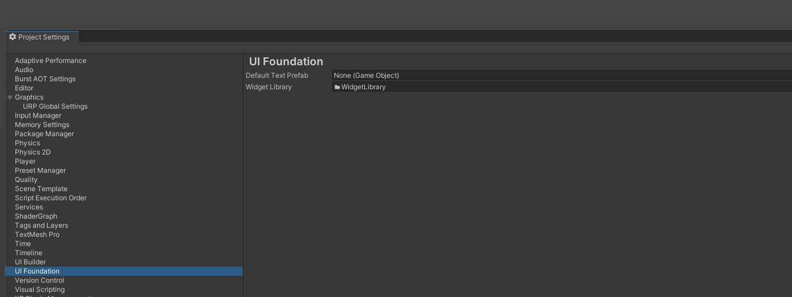

A tool for create ui

# UPM Package

## Install via git URL
https://github.com/Xhh-UnityCustomPackages/UIFoundation.git?path=Packages/com.game.ui.foundation

# UI Design Tool

## Pictures
Use Overlay Menu to open

点击T按钮直接生成文本组件
点击Image按钮直接生成Image组件
点击Widget按钮打开组件库界面

组件库界面

通关Asset Flag来组织目录

设置界面可以修改默认创建的文本物体

* **对齐按钮：** 分为「上」、「中」、「下」、「左」、「中」、「右」共6个按钮。  
  当选中单个UI节点，则将该节点与父节点对齐。当选中多个UI节点，则将其他节点与第一个节点对齐。  
  当按住Shift键再点击时，会同时设置节点的轴点。  
* 按住「Alt」键将图片拖放到 Hierarchy窗口 内的 RectTransform 下可直接创建 Image 。<mark>（Unity2021.2及之后版本才支持。）</mark>  
  * **注意：** 放开时，必须按住Alt键，且指针指的是一个RectTransform。否则将默认创建SpriteRenderer。  
* 按住「Alt」键将图片拖放到 Scene窗口 内的 Canvas框 中可直接创建 Image 。  
  * **注意：** 放开时，必须按住Alt键，且指针指在某个Canvas框内。否则将默认创建SpriteRenderer。  
* 按住「Alt」键且 Scene窗口 拥有焦点时，方向键可移动 Transform 。  
  * **注意：** Scene窗口拥有焦点时才可移动。  